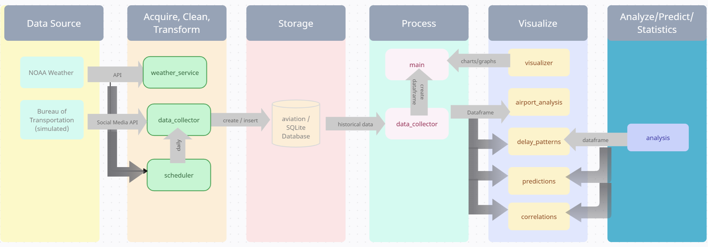

# **AeroWeather: Weather and Flight Delay Analytics Dashboard**

## **Overview**
This project integrates weather and flight delay data to create an analytics dashboard and predictive model. The system allows users to explore delay trends, analyze the influence of weather conditions on delays, and predict potential delays using machine learning. 

---

## **Key Components**

### **1. Data Sources**
- **Weather Data**: NOAA weather API ([weather.gov/api](https://weather.gov/api)) provides real-time and historical weather data, including precipitation, temperature, and other meteorological metrics.
- **Flight Data**: Bureau of Transportation Statistics offers detailed information on flight delays, cancellations, and operational metrics.
- **Daily Scheduler**: A scheduler (via the `schedule` library) checks for and retrieves new data daily, ensuring the system remains updated with the latest information.

---

### **2. Data Storage**
- **SQLite Database**:
  - Acts as the central repository for storing data.
  - Chosen for its simplicity, lightweight nature, and compatibility with Python.
  - Supports rapid prototyping and is suitable for small to medium datasets.

---

### **3. Data Cleaning and Processing**
- **Scripts**:
  - **`data_collector.py`**: Handles data ingestion and initial structuring.
  - **`weather_service.py`**: Processes weather data, handling missing values and ensuring alignment between weather and flight datasets.
- **Key Operations**:
  - Addressing missing or invalid entries through imputation or filtering.
  - Connecting datasets using temporal and geospatial keys (e.g., airport codes and timestamps).

---

### **4. Data Governance**
To ensure the integrity and usability of the data, the following governance principles need to be considered:
- **Data Quality**: Regular validation checks during ingestion and cleaning to identify and rectify inconsistencies.
- **Version Control**: Historical data snapshots are maintained to facilitate model retraining and audits.
- **Compliance**: Adherence to standards for using government-provided data (e.g., respecting terms of service and proper citation).

---

### **5. Security**
The following measures need to be  implemented to safeguard the system:
- **Data Security**:
  - Sensitive data (e.g., API keys) is stored securely in environment variables.
  - Encryption is used to secure data transfers between components when necessary.
- **Access Control**:
  - Restricted access to the database and scripts to authorized users only.
  - Role-based permissions for accessing raw versus processed datasets.

---

### **6. Machine Learning Model**
- **Algorithm**: A Random Forest model is used for predicting flight delays.
- **Features**:
  - Inputs include precipitation, temperature, location (airport), and day of the week.
  - Output is the predicted delay time in minutes.
- **Retraining**:
  - The model can be  periodically retrained using new data.
  - Trained model parameters and metadata are saved for future reuse.
- **Justification**:
  - Random Forest is chosen for its robustness against overfitting and its ability to handle non-linear relationships, which are common in weather and delay data.

---

### **7. Scalability**

Here are some additions that can be made to address scalability:
- **System Design**:
  - Transition to a cloud-based architecture (e.g., AWS or Azure) is feasible for larger datasets.
  - Use of distributed processing frameworks like Apache Spark for handling high volumes of data.
- **Database Scalability**:
  - Migration from SQLite to a relational database like PostgreSQL or a data warehouse like Snowflake can support larger workloads.
- **API Load Handling**:
  - Rate-limiting and queuing mechanisms can be added to manage high-frequency API requests.

---

### **8. Fault Tolerance**
- **Error Handling**:
  - Comprehensive error-checking mechanisms are implemented across all stages of the pipeline.
  - Automated logging captures issues, with detailed logs maintained for debugging and monitoring.
- **Scheduler Resilience**:
  - Daily data updates are designed with retry mechanisms to handle temporary API or network failures.

---

### **9. Tools and Technologies**
This project is developed using **Python** and **Streamlit**, along with the following libraries:

| Library         | Purpose                                                                                        |
|------------------|------------------------------------------------------------------------------------------------|
| `joblib`        | Efficient storage and retrieval of trained machine learning models.                             |
| `matplotlib`    | Creation of static visualizations to complement dashboard components.                           |
| `numpy`         | Numerical computations, particularly for matrix operations during data processing and modeling. |
| `pandas`        | Handling structured data with DataFrames for cleaning, transformation, and integration.         |
| `plotly`        | Interactive visualizations for the analytics dashboard.                                         |
| `requests`      | Retrieving data from APIs (e.g., NOAA and DOT).                                                 |
| `schedule`      | Automating daily data updates via a lightweight scheduler.                                      |
| `scikit-learn`  | Building and training the Random Forest predictive model.                                       |
| `scipy`         | Supporting advanced statistical computations for model evaluation.                              |
| `streamlit`     | Creating a user-friendly, interactive dashboard for insights.                                   |

**Justification**:
- Python libraries were chosen for their extensive community support and flexibility in handling diverse tasks (e.g., data manipulation, visualization, and machine learning).
- Streamlit is particularly well-suited for creating interactive dashboards quickly and allows easier transition from Juypter notebooks.

---

### **10. Conclusion**
This project demonstrates an effective way to combine disparate datasets into a cohesive analytics and predictive framework. By leveraging modular Python scripts, reliable libraries, and a lightweight database, it offers both simplicity and scalability. Future enhancements can include cloud deployment, real-time predictions, and integration of additional data sources for broader insights.

